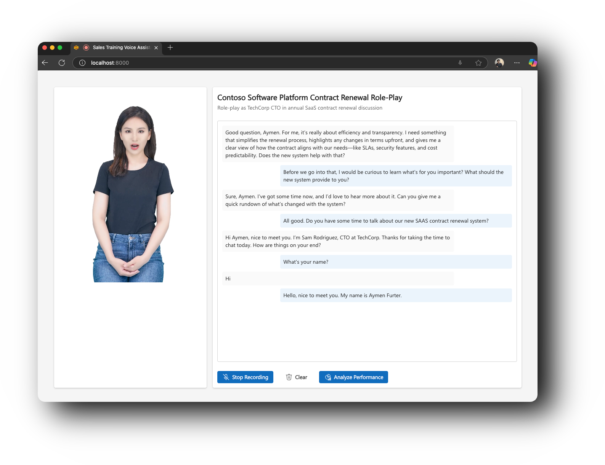
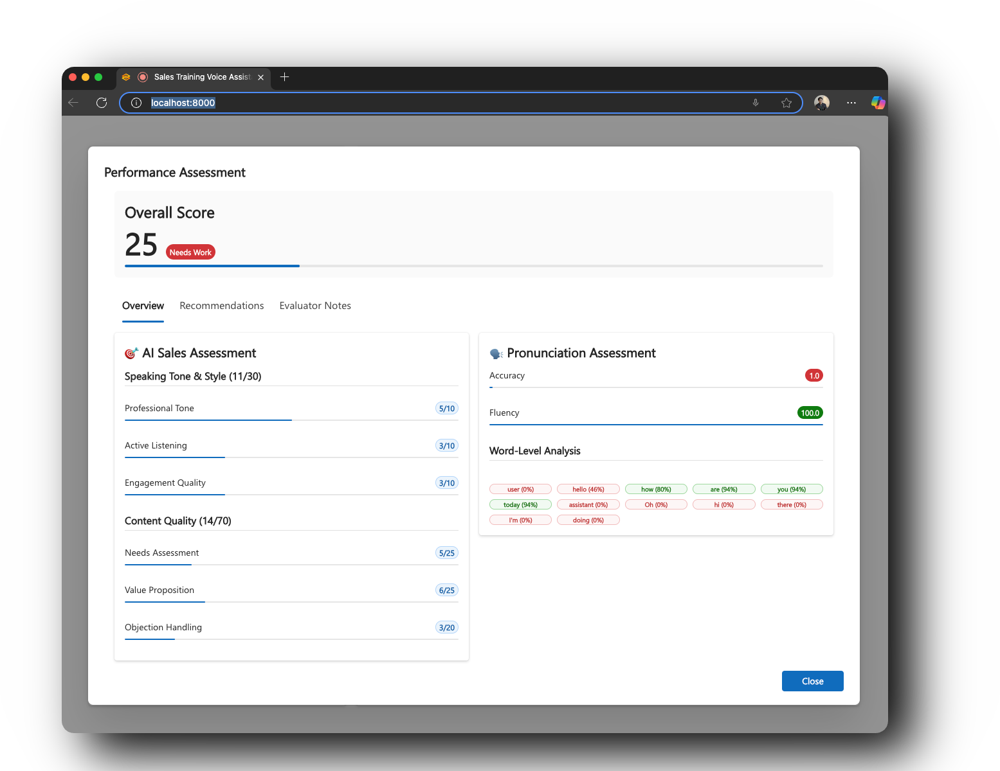
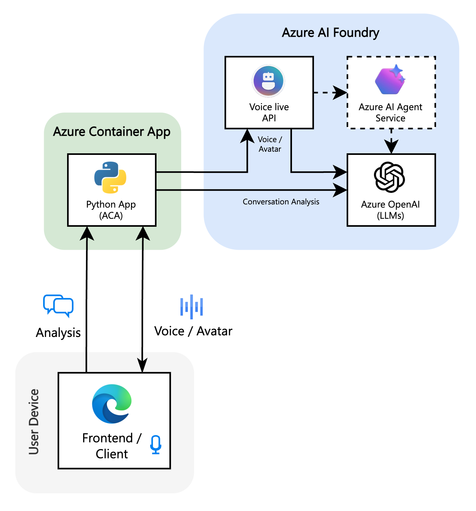

<p align="center">
   <h1 align="center">Voice Live API: AI Salescoach</h1>
</p>
<p align="center">A demo application showcasing AI-powered voice training for sales professionals, built on Azure.</p>
<p align="center">
   <a href="https://github.com/Azure-Samples/voicelive-api-salescoach"></a>
   <a href="https://github.com/Azure-Samples/voicelive-api-salescoach/blob/main/LICENSE"></a>
   <a href="https://azure.microsoft.com"></a>
</p>



---

## Overview

Voice Live API Salescoach is a demo application showcasing how AI-based training could be used in sales education using Azure AI services. Practice real-world sales scenarios with AI-powered virtual customers, receive instant feedback on your performance, and improve your sales skills through immersive voice conversations.

### Features

- **Real-time Voice Conversations** - Practice sales calls with AI agents that respond naturally using Azure Voice Live API
- **Performance Analysis** - Get detailed feedback on your conversation skills
- **Pronunciation Assessment** - Improve your speaking clarity and confidence with Azure Speech Services
- **Scoring System** - Track your progress with metrics



### Tech Stack

- **Azure AI Foundry** - Agent orchestration and management
- **Azure OpenAI** - GPT-4o for LLM responses and performance analysis 
- **Azure Voice Live API** - Real-time speech-to-speech conversations with AI agents
- **Azure Speech Services** - Post-conversation fluency and pronunciation analysis
- **React + Fluent UI** - Modern, accessible user interface
- **Python Flask** - Backend API and WebSocket handling

## Getting Started 

### Prerequisites

- **Node.js**: Install [Node.js](https://nodejs.org/) for the frontend development.
- **Python**: Install [Python](https://www.python.org/downloads/) for the backend development.

### Local Development

1. **Clone the repository**
   ```bash
   git clone https://github.com/Azure-Samples/voicelive-api-salescoach.git
   cd voicelive-api-salescoach
   ```

2. **Set up environment variables**
   ```bash
   cp config/.env.example .env
   # Edit .env with your Azure credentials
   ```

3. **Install dependencies**
   ```bash
   # Backend dependencies
   cd backend
   pip install -r requirements.txt
   cd ..
   
   # Frontend dependencies
   cd frontend
   npm install
   cd ..
   ```

4. **Build the frontend**
   ```bash
   cd frontend
   npm run build
   cd ..
   ```

5. **Start the application**
   ```bash
   cd backend
   python src/app.py
   ```

Visit `http://localhost:8000` to start training!

### Deploy to Azure

1. **Initialize Azure Developer CLI**:
   ```bash
   azd init
   ```

2. **Deploy to Azure**:
   ```bash
   azd up
   ```
3. **Access your application**:
   The deployment will output the URL where your application is running.


## Development

### Code Quality & Linting

This project uses linting tools to maintain code quality:

- **Python**: flake8 and black for linting and formatting
- **TypeScript**: ESLint and Prettier for linting and formatting

#### Available Scripts

```bash
# Run linters
npm run lint

# Format code
npm run format

# Run tests
npm run test
```

## Demo 

1. **Choose a Scenario** - Select from various sales situations (cold calling, objection handling, etc.)
2. **Start the Conversation** - Click the microphone and begin your sales pitch
3. **Engage with AI** - The virtual customer responds realistically based on the scenario
4. **Receive Feedback** - Get instant analysis on your performance including:
   - Speaking tone and style
   - Content quality
   - Needs assessment
   - Value proposition delivery
   - Objection handling skills

## Architecture

<p align="center">
The following diagram shows the high-level architecture of Voice Live API Salescoach and how it integrates with various Azure AI services:
</p>

<p align="center">

</p>

## Contributing

This project welcomes contributions and suggestions. Most contributions require you to agree to a
Contributor License Agreement (CLA) declaring that you have the right to, and actually do, grant us
the rights to use your contribution. For details, visit https://cla.opensource.microsoft.com.

When you submit a pull request, a CLA bot will automatically determine whether you need to provide
a CLA and decorate the PR appropriately (e.g., status check, comment). Simply follow the instructions
provided by the bot. You will only need to do this once across all repos using our CLA.

This project has adopted the [Microsoft Open Source Code of Conduct](https://opensource.microsoft.com/codeofconduct/).
For more information see the [Code of Conduct FAQ](https://opensource.microsoft.com/codeofconduct/faq/) or
contact [opencode@microsoft.com](mailto:opencode@microsoft.com) with any additional questions or comments.

## Security

Microsoft takes the security of our software products and services seriously, which includes all source code repositories managed through our GitHub organizations, which include [Microsoft](https://github.com/Microsoft), [Azure](https://github.com/Azure), [DotNet](https://github.com/dotnet), [AspNet](https://github.com/aspnet) and [Xamarin](https://github.com/xamarin).

If you believe you have found a security vulnerability in any Microsoft-owned repository that meets [Microsoft's definition of a security vulnerability](https://aka.ms/security.md/definition), please report it to us as described in [SECURITY.md](SECURITY.md).

## Trademarks

This project may contain trademarks or logos for projects, products, or services. Authorized use of Microsoft 
trademarks or logos is subject to and must follow 
[Microsoft's Trademark & Brand Guidelines](https://www.microsoft.com/en-us/legal/intellectualproperty/trademarks/usage/general).
Use of Microsoft trademarks or logos in modified versions of this project must not cause confusion or imply Microsoft sponsorship.
Any use of third-party trademarks or logos are subject to those third-party's policies.