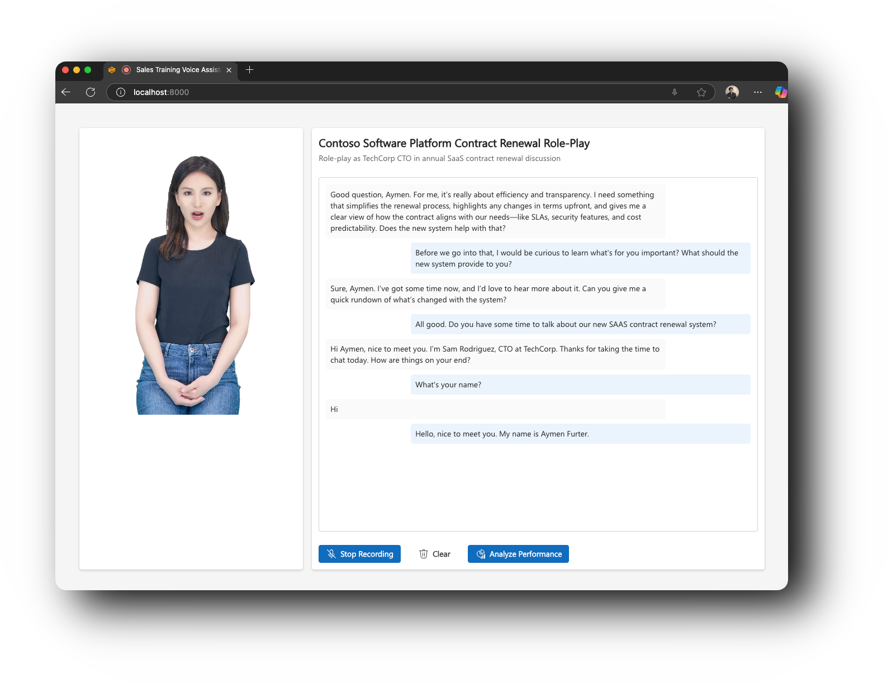
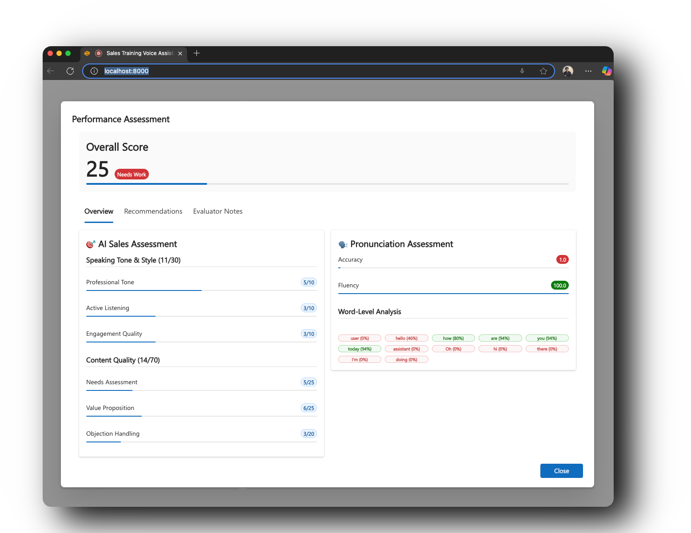
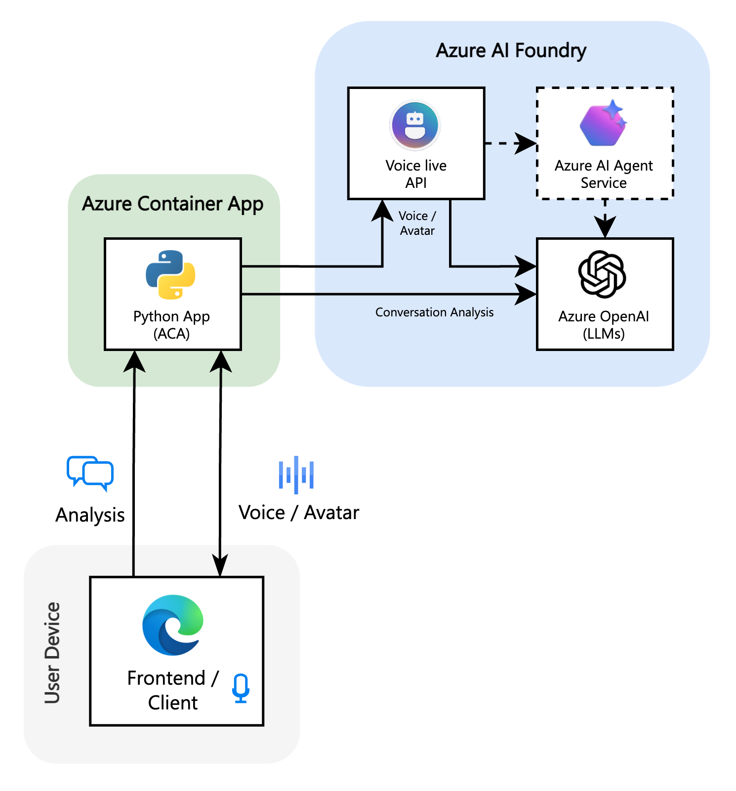

<!--
---
name: Voice Live API Sales Coach (Python + React)
description: A demo application showcasing AI-powered voice training for sales professionals using Azure Voice Live API and Azure AI services.
languages:
- python
- typescript
- bicep
- azdeveloper
products:
- azure-openai
- azure-ai-foundry
- azure-speech
- azure
page_type: sample
urlFragment: voicelive-api-salescoach
---
-->
<p align="center">
   <h1 align="center">Voice Live API: AI Sales Coach</h1>
</p>
<p align="center">A demo application showcasing AI-powered voice training for sales professionals, built on Azure.</p>
<p align="center">
   <a href="https://github.com/Azure-Samples/voicelive-api-salescoach/blob/main/LICENSE.md"></a>
   <a href="https://github.com/Azure-Samples/voicelive-api-salescoach/actions/workflows/lint-and-test.yml"></a>&nbsp;
   <a href="https://portal.azure.com/#create/Microsoft.Template/uri/https%3A%2F%2Fraw.githubusercontent.com%2FAzure-Samples%2Fvoicelive-api-salescoach%2Frefs%2Fheads%2Fmain%2Finfra%2Fdeployment.json"></a>&nbsp;
</p>



---

## Overview

Voice Live API Salescoach is a demo application showcasing how AI-based training could be used in sales education using Azure AI services. Practice real-world sales scenarios with AI-powered virtual customers, receive instant feedback on your performance, and improve your sales skills through immersive voice conversations.

> **Related project:** [Live Voice Practice](https://github.com/Azure/live-voice-practice) is a fork of this repository that extends it with a secure private-cloud deployment scenario and a broader call-center agent training use case.

### Features

- **Real-time Voice Conversations** - Practice sales calls with AI agents that respond naturally using Azure Voice Live API
- **Performance Analysis** - Get detailed feedback on your conversation skills
- **Pronunciation Assessment** - Improve your speaking clarity and confidence with Azure Speech Services
- **Scoring System** - Track your progress with metrics



## Demo

See the Voice Live API Salescoach in action:

https://github.com/user-attachments/assets/904f1555-6981-4780-ae64-c5757337bcad

### How It Works

1. **Choose a Scenario** - Select from various industry-specific sales situations
2. **Start the Conversation** - Click the microphone to start your simulation
3. **Engage with AI** - The virtual customer responds realistically based on the scenario
4. **Receive Feedback** - Get instant analysis on your performance including:
   - Speaking tone and style
   - Content quality
   - Needs assessment
   - Value proposition delivery
   - Objection handling skills

## Getting Started

### Deploy to Azure

The deployment creates Azure AI and Speech resources and a Container App. It deploys
`gpt-4.1-mini` for conversation analysis and scenario generation. The app does not
require an embedding model. Select a region that supports Voice Live and the model
deployment, such as Sweden Central, and confirm that your subscription has enough
model quota.
The container builds the frontend with Node.js 24 LTS and uses Python 3.11 on
Debian 12 (Bookworm), which the Speech SDK supports.
Container builds verify HTTPS certificates when downloading npm and Python packages.
If your network uses a private certificate authority, configure its trusted CA
certificate instead of disabling verification.

The application uses Voice Live SDK 1.3 with the GA `2026-07-15` API, Speech SDK
1.51, and OpenAI SDK 3 with the GA `/openai/v1/` endpoint. Azure OpenAI keys and
Microsoft Entra ID authentication are supported. Token authentication refreshes
credentials automatically.

1. **Deploy to Azure**:
   ```bash
   azd up
   ```
2. **Access your application**:
   The deployment will output the URL where your application is running.

### Local Development

This project includes a dev container for easy setup and a build script for  development.
For development without a container, use Python 3.11 or 3.12 and Node.js 24 LTS.
The build script installs the committed npm lockfile with `npm ci`; it does not
delete or regenerate the lockfile.
TypeScript 7 compiles the frontend. Microsoft's TypeScript 6 compatibility package
provides the JavaScript compiler API required by the current ESLint parser, using
the [official side-by-side setup](https://devblogs.microsoft.com/typescript/announcing-typescript-7-0/).

1. **Use Dev Container** (Recommended)
   - Open in VS Code and select "Reopen in Container" when prompted
   - All dependencies and tools are pre-configured

2. **Fill in the .env file**
   - Copy `.env.template` to `.env`
   - Fill in your Azure AI Foundry and Speech service keys and endpoints (you can run `azd provision` to create these resources if you haven't already)

3. **Build and run**
   ```bash
   # Build the application
   ./scripts/build.sh

   # Start the server
   cd backend && python src/app.py
   ```

Visit `http://localhost:8000` to start training!

### Optional Foundry agents

Instruction-based scenarios remain the default. To use Foundry agents, set
`USE_AZURE_AI_AGENTS=true` and `PROJECT_ENDPOINT` to an existing Foundry project
endpoint, such as `https://<resource>.services.ai.azure.com/api/projects/<project>`.
The deployment templates do not create this project. The application identity
must have the required Foundry access, and scenario models must be deployed in
that project.

The application creates prompt-agent versions with Projects SDK 2 and connects
Voice Live to the returned agent name and version. Agent connections use
Microsoft Entra ID, even when an OpenAI API key is configured. For connections
without a scenario agent, `AGENT_NAME` selects an existing agent and
`AGENT_VERSION` optionally selects its version. `AZURE_AI_PROJECT_NAME` is
inferred from the project endpoint when omitted. `AGENT_ID` remains available for
legacy agents and is not required for newly created agents.

See the [Microsoft Learn Foundry voice-agent quickstart](https://learn.microsoft.com/azure/ai-services/speech-service/voice-live-agents-quickstart)
for project and role setup.

## Architecture

<table>
<tr>
<td width="400">

</td>
<td>

The application leverages multiple Azure AI services to deliver real-time voice-based sales training:

- **Azure AI Foundry** - AI platform including:
  - Voice Live API for real-time speech-to-speech conversations and avatar simulation
  - Large language models (GPT-4o) as underlying LLM for performance analysis
  - Speech Services for post-conversation pronunciation and fluency assessment
  - Optional AI Agent Service
- **React + Fluent UI** - Modern web interface
- **Python Flask** - Backend API and WebSocket communication

**Conversation Flow:** User speech → Voice Live API → GPT-4o processing → AI agent response → Performance analysis → Detailed feedback

</td>
</tr>
</table>


## Contributors
<p float="left">
  <a href="https://github.com/aymenfurter"></a>
  <a href="https://github.com/curia-damiano"></a>
  <a href="https://github.com/TiffanyZ4Msft"></a>
</p>

## Contributing

This project welcomes contributions and suggestions. Most contributions require you to agree to a
Contributor License Agreement (CLA) declaring that you have the right to, and actually do, grant us
the rights to use your contribution. For details, visit https://cla.opensource.microsoft.com.

When you submit a pull request, a CLA bot will automatically determine whether you need to provide
a CLA and decorate the PR appropriately (e.g., status check, comment). Simply follow the instructions
provided by the bot. You will only need to do this once across all repos using our CLA.

This project has adopted the [Microsoft Open Source Code of Conduct](https://opensource.microsoft.com/codeofconduct/).
For more information see the [Code of Conduct FAQ](https://opensource.microsoft.com/codeofconduct/faq/) or
contact [opencode@microsoft.com](mailto:opencode@microsoft.com) with any additional questions or comments.

## Security

Microsoft takes the security of our software products and services seriously, which includes all source code repositories managed through our GitHub organizations, which include [Microsoft](https://github.com/Microsoft), [Azure](https://github.com/Azure), [DotNet](https://github.com/dotnet), [AspNet](https://github.com/aspnet) and [Xamarin](https://github.com/xamarin).

If you believe you have found a security vulnerability in any Microsoft-owned repository that meets [Microsoft's definition of a security vulnerability](https://aka.ms/security.md/definition), please report it to us as described in [SECURITY.md](SECURITY.md).

## Trademarks

This project may contain trademarks or logos for projects, products, or services. Authorized use of Microsoft
trademarks or logos is subject to and must follow
[Microsoft's Trademark & Brand Guidelines](https://www.microsoft.com/en-us/legal/intellectualproperty/trademarks/usage/general).
Use of Microsoft trademarks or logos in modified versions of this project must not cause confusion or imply Microsoft sponsorship.
Any use of third-party trademarks or logos are subject to those third-party's policies.
Any use of third-party trademarks or logos are subject to those third-party's policies.


<p align="center">
   <br/>
   <br/>
   Made with ❤️ in 🇨🇭
</p>
